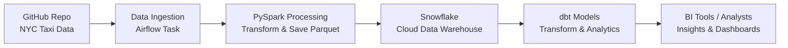

1. **Pipeline Architecture** – high-level flow (GitHub → Spark → Docker  → Snowflake → dbt → Analytics)
2. **Airflow DAG Workflow** – orchestration steps


````markdown
# NYC Yellow Taxi Data Pipeline 

## Overview
This project builds a **robust big data pipeline** to process and analyze NYC Yellow Taxi Trip data.  
It leverages **Apache Spark** for processing, **Snowflake** for storage, **dbt** for data modeling, and **Astronomer Airflow** for orchestration.  

The pipeline automates:
- Downloading trip data from a public GitHub repository
- Transforming it into Parquet format
- Uploading it to Snowflake
- Running analytics with dbt  
All tasks are orchestrated through **scheduled Airflow workflows**.

---

## Key Objectives
- Ingest and process large-scale taxi trip datasets  
- Apply transformations (filtering, aggregations, metrics) for insights  
- Store processed data in a snowflakes cloud data warehouse  
- Enable scalable analytics via dbt models  
- Automate the end-to-end process with Airflow  

**Audience**: Data engineers, analysts, and teams working on big data and cloud-based analytics.  

---

##  Features
- **Data Ingestion**: Download raw data from GitHub releases  
- **Data Processing**: Use PySpark to transform and save as Parquet  
- **Data Storage**: Load processed data into Snowflake  
- **Data Analysis**: Model and query with dbt (e.g., average fares by vendor)  
- **Workflow Automation**: Schedule & monitor with Astronomer Airflow  

---

##  Technologies
- **VSCode** – Code editor for development  
- **Docker** – Containerized environments (Spark & Airflow)  
- **Python 3.8+** – Core scripting language  
- **PySpark** – Distributed data processing  
- **Snowflake** – Cloud data warehouse  
- **dbt** – Data transformations & analytics  
- **Astronomer Airflow** – Workflow orchestration  
- **GitHub** – Repository hosting and data source  

(Optional: Ubuntu/Linux setup supported via Docker)

---

##  Prerequisites
Before running, ensure you have:  
- **VSCode** (for editing scripts/configs)  
- **Docker** (for Spark & Airflow containers)  
- **Python 3.8+**  
- **Snowflake account** with:
  - Account URL (e.g., `https://xxxxxx.snowflakecomputing.com`)  
  - Database, schema, warehouse, username, password  
  - JSON config (`extra.json`) storing account, database, schema  
- **dbt** (CLI or dbt Cloud) configured for Snowflake  
- **Astronomer Airflow** (cloud or local via Docker)  

---

##  Setup Instructions
1. **Clone the Repository**
   ```bash
   git clone https://github.com/<your-repo>/nyc-yellow-taxi-pipeline.git
   cd taxi_bigData_project
````

2. **Configure Docker**

   * Use `Dockerfile` + `docker-compose.override.yml`
   * Start containers:

     ```bash
     astro dev build
     astro dev start
     ```

3. **Install Dependencies**
   Inside the container:

  

4. **Set Up Snowflake Connection**

   * Provide credentials via Airflow UI or `extra.json`

5. **Configure dbt**

   * **CLI**: Create `profiles.yml` with Snowflake details
   * **Cloud**: Create project, connect Snowflake, generate API key, note Job ID + Account ID

---

##  Pipeline Architecture



---

##  Airflow DAG Workflow

```mermaid
flowchart TD
    start([Start DAG]) --> ingest[Ingest Data\nfrom GitHub]
    ingest --> process[Process Data\nwith PySpark]
    process --> upload[Upload to Snowflake]
    upload --> run_dbt[Run dbt Models]
    run_dbt --> end([End DAG])
```

---

##  Project Structure

```
data/               # Raw downloaded datasets
processed_data/     # Spark-processed Parquet files
dbt_project/        # dbt models & configs
dags/               # Airflow workflow definitions
scripts/            # Utility processing scripts
Dockerfile          # Container setup for Spark & Airflow
docker-compose.override.yml  # Container overrides
extra.json          # Snowflake connection details
README.md           # Project documentation
```

---

##  Running the Pipeline

1. Start Docker or deploy on Astronomer Cloud
2. Open Airflow UI
3. Enable DAG: 
4. Monitor task runs
5. Verify Snowflake tables & dbt model results

---

##  Security Best Practices

* Store secrets (Snowflake creds, dbt API key) in **Airflow Connections** or **env vars**
* **Never commit sensitive data** to GitHub
* Use **secure Snowflake & dbt integrations**

---

##  Contributing

1. Fork repo
2. Create feature branch
3. Commit changes
4. Submit pull request

Follow project coding & documentation standards.

---


##  Contact
**tunwaju@gmail.com**

```

